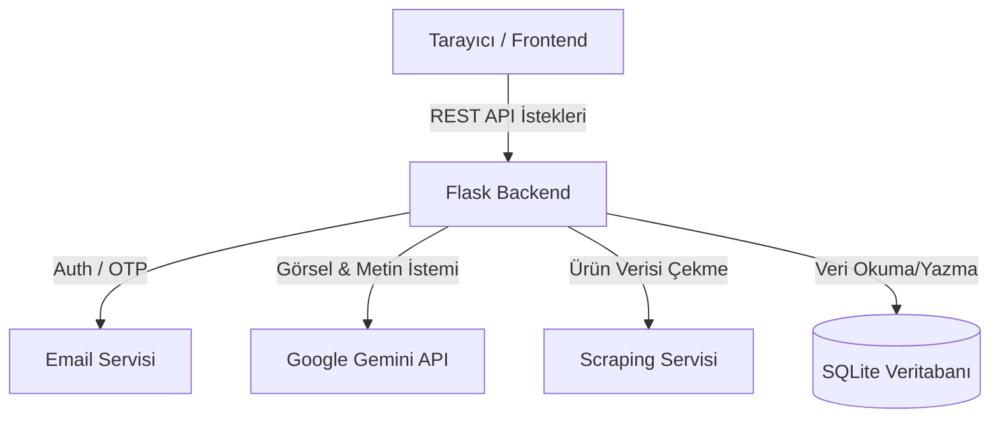

# 🌸 SkinSense AI — Dönem Projesi Raporu
**DÖNEM PROJESİ — Flask ile Web Uygulaması Geliştirme**

## 1. Projenin Amacı ve Ne İşe Yaradığı
SkinSense AI, kullanıcıların cilt analizini (fotoğraf veya anket üzerinden) Google Gemini AI kullanarak gerçekleştiren; akne, nem, gözenek ve hassasiyet gibi problemleri tespit edip kişiye özel sabah/akşam cilt bakım rutinleri ve dermokozmetik ürün önerileri sunan bir web uygulamasıdır. Ayrıca, kullanıcıların ellerindeki ürünlerin içerik listelerini (ingredients) sisteme girerek bu maddelerin cilde uygunluğunu trafik ışığı sistemiyle puanlamasına olanak tanır ve bilinçsiz ürün tüketiminin önüne geçmeyi hedefler.

## 2. Mimari Özet (Klasör Yapısı ve Ana Akışlar)
Proje, Frontend (Kullanıcı arayüzü) ve Backend (Sunucu) olarak iki ayrık klasör yapısında kurgulanmıştır.
- `backend/`: Flask, SQLAlchemy Modelleri, API Route'ları (Auth, Analysis, Products, Ingredients) ve Servisler (Gemini, Web Scraper, Email).
- `frontend/`: HTML, CSS (Vanilla), API çağrıları için `api.js` ve arayüz dosyaları.

**Ana Akış Diyagramı:**

## 3. Vibe Coding Deneyimi: Ne İşe Yaradı, Nerede Zorlanıldı?
**Vibe coding (yapay zeka yönlendirmeli kodlama)** süreci, özellikle arayüz tasarımı (CSS ile glassmorphism, renk paleti yönetimi) ve sıkıcı boilerplate (taslak) kodların (SQLAlchemy modelleri, Flask iskeleti) yazımında inanılmaz bir hız kazandırdı. "Rengi biraz daha toz pembe yap, şu butona hover efekti ver" gibi doğal dildeki direktiflerle anında sonuç almak geliştirme sürecini çok keyifli kıldı. 
**Zorlanılan nokta ise**, AI'ın bağlamdan kopup bazen projeye React veya Tailwind gibi başta istenmeyen karmaşık teknolojileri dahil etmeye çalışmasıydı. Ajanı doğru sınırlarda tutmak ve basit/Vanilla yaklaşımda kalması için prompt'ları (istemleri) çok net ve kısıtlayıcı vermek gerekti.

## 4. Antigravity'de En Faydalı Bulunan 2 Özellik
1. **Otonom Terminal ve Dosya Yönetimi:** Antigravity'nin projeye ait klasörleri kendi okuyup, kodları dosyaya direkt yazması ve terminalde (cmd) Python komutlarını çalıştırarak hataları canlı canlı test edebilmesi kopyala-yapıştır yükünü tamamen bitirdi.
2. **Artifact (Eser) ve Planlama Sistemi:** Mimari kararlar alınırken uygulamanın "Plan" moduna geçip Markdown dosyalarında (Artifacts) adım adım stratejiyi kullanıcıya sunması ve onay almadan kod yazmaması, projenin kontrolden çıkmasını engelledi.

## 5. Ajanın Yakalayıp Düzeltilen En Kritik 3 Hatası
1. **Windows Terminal Unicode (Emoji) Hatası:** Backend başlatılırken loglara basılan emoji karakterlerinin Windows CMD'de `UnicodeEncodeError` verip Flask'ı çökertmesi. Sistemin standart çıkışını UTF-8'e zorlayan (`sys.stdout = io.TextIOWrapper...`) bir yama ile aşıldı.
2. **Frontend Klasör Yolları (404 Hatası):** Ajanın CSS ve JS dosya yollarını kök dizinden (`/css/main.css`) verecek şekilde yazması nedeniyle VS Code Live Server'da dosyaların bulunamaması. Yollar bağıl (relative) formatta (`css/main.css`) düzeltildi.
3. **Payload Too Large (API Timeout):** Kullanıcının yüklediği orijinal boyuttaki yüksek çözünürlüklü fotoğrafların doğrudan Gemini API'ye gönderildiğinde boyut aşımı (veya süre aşımı) hatasına sebep olması. Ön tarafta veya backend okumasında fotoğrafların optimize edilerek gönderilmesi sağlandı.

## 6. AI Olmadan Sıfırdan Yapılsaydı Tahmini Süre
Tam teşekküllü bir Flask uygulaması kurmak, JWT tabanlı Auth (ve e-posta OTP) sistemini yazmak, modern ve responsive bir CSS tasarım sistemi oluşturup Chart.js ile veri bağlamak, web scraping altyapısı kurmak ve Google API entegrasyonlarını hatasız yapmak AI desteği olmadan **en az 3-4 haftalık** (günde 4-5 saatlik) yoğun bir kodlama süreci gerektirirdi. Antigravity sayesinde bu süreç günler seviyesine indi.

## 7. Projeyi Sürdürmek İstenirse Bir Sonraki Adım
Projeyi ileriye taşımak için bir sonraki adım, hava durumu (UV indeksi, nem oranı) API'lerini sisteme entegre etmek olurdu. Bu sayede kullanıcının bulunduğu lokasyon tespit edilerek, "Bugün UV çok yüksek, 50 SPF Güneş kremini unutma" şeklinde dinamik ve anlık bildirimler/öneriler sunan bir sistem geliştirilirdi. Ek olarak, ürün barkodu okutarak doğrudan içeriğine (Ingredient Check) ulaşma özelliği mobil uyumluluğu çok artırırdı.
