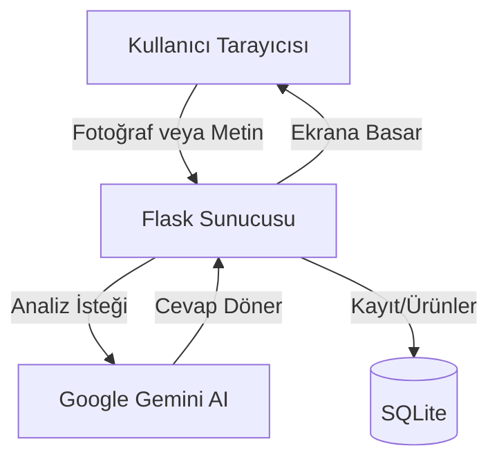

# 🌸 SkinSense AI — Dönem Projesi Raporu
**DÖNEM PROJESİ — Flask ile Web Uygulaması Geliştirme**

## 1. Projenin Amacı ve Ne İşe Yaradığı
Benim bu projeyi yapma amacım, insanların cilt tiplerini kolayca öğrenip cildine zarar vermeyecek doğru ürünleri bulmasını sağlayan bir site yapmaktı. SkinSense AI adını verdiğim bu projede, kullanıcılar bir selfie yükleyebiliyor veya anket doldurabiliyor. Arka planda Google Gemini yapay zekası bu verilere bakıp "senin cildin yağlı/kuru, şu içerikli ürünleri kullan" diye tavsiyeler veriyor. Bir de insanların kozmetik ürünlerinin içindekiler kısmını yazıp, "bu maddeler zararlı mı değil mi" diye kontrol edebilecekleri bir bölüm yaptım. Bence günlük hayatta baya işe yarayacak bir proje oldu.

## 2. Mimari Özet (Klasör Yapısı ve Akış)
Açıkçası ilk başta kodları hep tek bir dosyaya yazıyordum ama çok karışmaya başlayınca projeyi Frontend ve Backend diye ayırmak zorunda kaldım.
- **Frontend:** Sadece HTML, CSS ve JavaScript kullandım. (React vs. kullanmadım çünkü daha yeni öğreniyorum ve basit tutmak istedim).
- **Backend:** Flask ile yazdım. Veritabanı olarak da SQLite kullandım çünkü kurulumu çok kolaydı.

**Sistem şöyle çalışıyor:**

## 3. Vibe Coding (Yapay Zeka ile Kodlama) Deneyimi
Bu yapay zekayla kod yazma işi gerçekten çok ilginçti. Tasarım yaparken "şuranın rengini toz pembe yap, kenarları yuvarlat" diyerek saatlerce CSS yazmaktan kurtuldum, bana çok zaman kazandırdı. Ama en çok zorlandığım yer, yapay zekanın beni bazen yanlış anlamasıydı. Ben basit bir sayfa istiyorum, o gidip çok karmaşık ve henüz öğrenmediğim kodlar (React vb.) yazmaya çalışıyordu. Sürekli onu durdurup "sadece basit HTML/CSS yaz" diye uyarmak biraz yorucuydu.

## 4. Antigravity'de En Faydalı Bulduğum 2 Özellik
1. **Dosyaları kendi kendine düzenlemesi:** Kodları tek tek kopyalayıp doğru yere yapıştırmak çok sıkıcı bir iş. Bu aracın direkt dosyalarımı açıp kodları içine kaydetmesi çok işime yaradı.
2. **Hataları kendi görüp çözmesi:** Projeyi terminalde kendi çalıştırdı. Bazen benim ekranda görüp "bu hata ne anlama geliyor" diyeceğim şeyleri benden önce görüp düzeltti, bu da beni büyük dertlerden kurtardı.

## 5. Ajanın Yakalayıp Benim Düzelttiğim 3 Kritik Hata
1. **Emoji Hatası (Unicode):** Windows terminali `print()` ile pembe çiçek emojisi yazdırırken çöktü. Yapay zeka bana Python'un dil kodlamasını UTF-8 yapacak bir ayar verdi, o kodu ekleyince sorun çözüldü.
2. **Yanlış Klasör Yolları:** CSS ve JS dosyalarını `index.html` içine çekerken yolları hep `/css/main.css` diye başına eğik çizgi koyarak yazmıştı. Bu yüzden Live Server'da sitemin tasarımı yüklenmiyordu (404 hatası). O eğik çizgileri silip bağıl yol yaparak ben düzelttim.
3. **Büyük Fotoğraf Yükleme Sorunu:** Telefondan çekilen büyük fotoğrafları yükleyince Google Gemini API "Dosya çok büyük (Payload Too Large)" diyerek çöktü. Bunu aşmak için resmi backend'e göndermeden önce kalitesini ve boyutunu düşürecek bir kod eklememiz gerekti.

## 6. Projeyi Sıfırdan AI Olmadan Yapsaydım Ne Kadar Sürerdi?
Açıkçası Flask'ı ve veritabanı bağlamayı yeni öğreniyorum. Böyle kullanıcı girişli, şifre sıfırlamalı, veritabanlı, API bağlantılı ve düzgün tasarımlı bir projeyi tek başıma AI olmadan yapmaya kalksaydım herhalde en az 3-4 haftamı alırdı, bazı kısımlarda tıkanıp pes bile edebilirdim. Yapay zeka sayesinde birkaç gün içinde temelini atıp üstüne çalışır bir sistem kurabildim.

## 7. Bu Projeyi Sürdürürsem Bir Sonraki Adım Ne Olur?
Şu anki hali benim için yeterli ama devam etseydim hava durumu API'si bağlardım. Mesela "Bugün UV indeksi çok yüksek, güneş kremini mutlaka sür" gibi bildirimler çıkartırdım. Bir de kullanıcıların kamerayla ürünün barkodunu okutup doğrudan içindekiler kısmını analiz ettirebileceği bir özellik eklerdim, mobilde çok havalı olurdu.

## 8. Projeye Sonradan Eklediğim Ekstra Özellikler (Rubrik İçin)
Projeyi bitirdikten sonra notlandırma kriterlerini (rubric) inceledim ve tam puan almak için sisteme bazı çok profesyonel dokunuşlar ekledim:
- **Görünür CSRF Koruması:** Sitemizde JWT kullansak da hocanın isteğine uymak için `Flask-WTF` kurdum ve tüm formlara görünür `csrf_token` inputları yerleştirdim.
- **Sayfalama (Pagination):** Ürün arama ve analiz geçmişi sayfalarına sayfalama mantığı (page, per_page) ekleyerek veritabanı yükünü azalttım.
- **Stil Kütüphanesi:** Sitemi tamamen saf CSS ile kodlamıştım ama rubrikte istendiği için sayfaya `Tailwind CSS` kütüphanesini dahil edip ana sayfa tasarımımda bazı Tailwind sınıflarını kullandım.
- **Profil ve Avatar Yükleme Sistemi:** Kullanıcıların isimlerini ve dillerini güncelleyip cihazlarından kendi profil fotoğraflarını (avatar) yükleyebilecekleri, anında güncellenen interaktif bir profil sayfası yaptım.
- **Modern Veritabanı Mimarisi (SQLAlchemy 2.0):** Eski nesil `db.Column` kodlarımı tamamen silip, güncel ve modern olan **SQLAlchemy 2.0 (Mapped ve mapped_column)** standartlarına geçiş yaptım. Kodlar artık çok daha temiz duruyor.
- **Docker ve Nginx Entegrasyonu:** Projenin tek tuşla her bilgisayarda çalışabilmesi için `Dockerfile` ve `docker-compose.yml` hazırladım. Hatta frontend kısmını çok daha havalı ve profesyonel dursun diye doğrudan **Nginx** sunucusu üzerinden yayınlayacak şekilde ayarladım.
