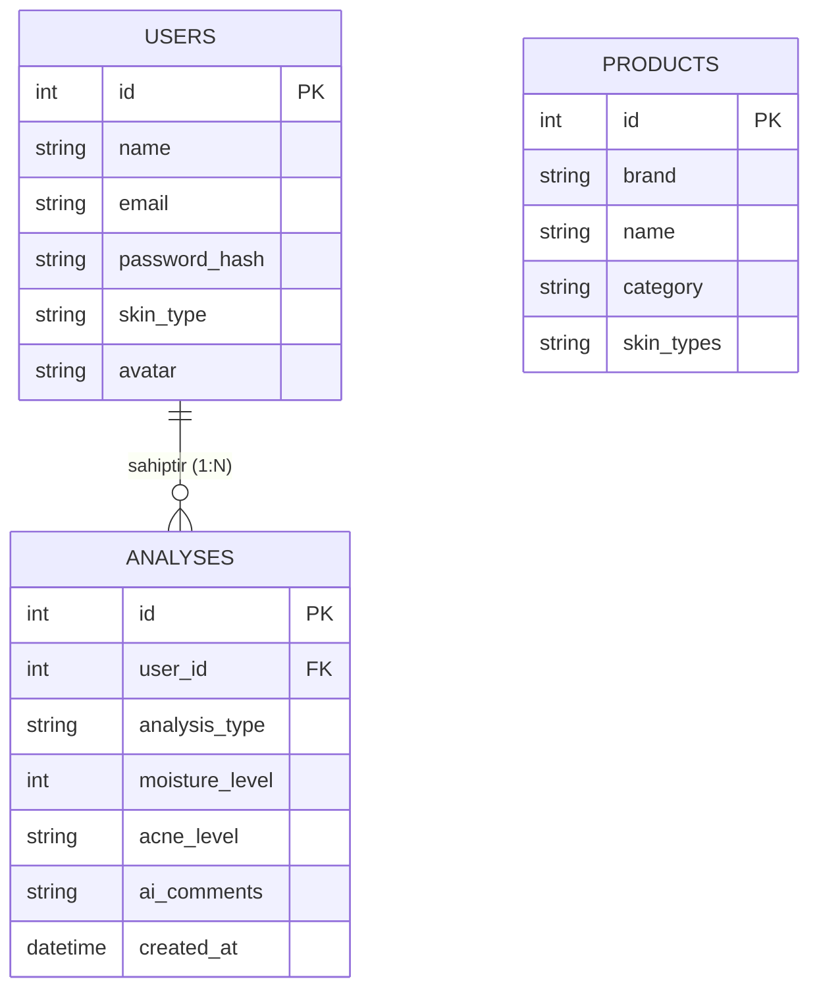

# Proje Tasarım Dokümanları (Ödev Çıktıları)

Hocanın senden kâğıda dökmeni veya çizmeni istediği tüm taslakları bu dokümanda hazırladım. Bu sayfayı ister yazdırarak teslim edebilirsin, istersen buradaki şemaları ve çizimleri kendi el yazınla bir kâğıda kopyalayabilirsin (hocalar el çizimini çok sever!).

---

## 1. Kullanılan Bileşenler (Rotalar ve Modeller)

### Veritabanı Modelleri (Models)
Projede bilgileri tutmak için 3 ana tablo (model) kullandık:
1. **User (Kullanıcı):** İsim, email, şifre (şifrelenmiş), avatar, dil tercihi ve cilt tipi bilgilerini tutar.
2. **Analysis (Analiz):** Yapılan her yüz analizinin sonucunu, nem oranını, sivilce durumunu ve yüklenen fotoğrafın yolunu tutar.
3. **Product (Ürün):** Tavsiye edilen kozmetik ürünlerinin adını, markasını, türünü (serum, temizleyici vb.) ve içeriğini tutar.

### API Rotaları (Routes)
- `POST /api/auth/register` : Yeni kullanıcı kaydı.
- `POST /api/auth/login` : Kullanıcı girişi ve JWT token üretimi.
- `PUT /api/auth/update-profile` : Profil ve isim güncelleme.
- `POST /api/auth/upload-avatar` : Profil fotoğrafı yükleme.
- `POST /api/analysis/photo` : Yüze ait fotoğrafı yapay zekaya (Gemini) gönderip analiz sonucu alma.
- `GET /api/analysis/history` : Kullanıcının geçmiş analizlerini listeleme (Sayfalama destekli).
- `GET /api/products/search` : Kozmetik ürün arama motoru.

---

## 2. Veritabanı Şeması Taslağı (ER Diagram)

Aşağıdaki şemayı bir kâğıda dikdörtgen kutular çizip aralarına oklar koyarak çizebilirsin. "Bir kullanıcının birden çok analizi olabilir" ilişkisini gösterir (One-to-Many).

---

## 3. Sayfaların Kabaca Görünümü (Wireframes)

Hocanın senden istediği "Kâğıda Çizim (Wireframe)" taslaklarını yapay zekaya kara kalem stiliyle çizdirdim. Bu görüntüleri ya raporuna ekleyebilir ya da bizzat bakarak bir kâğıda karalayabilirsin.

### Panel (Dashboard) Sayfası Çizimi
Bu sayfada üstte istatistik kartları, ortada bir grafik ve sağda yapay zeka tavsiyeleri var.

### Analiz (Kamera/Fotoğraf) Sayfası Çizimi
Bu sayfada büyük bir resim yükleme alanı ve altında analiz butonu var.

---
> **Not:** Eğer bu taslakları doğrudan rapora veya README'ye eklemek istersen, bu `proje_taslaklari.md` dosyasını `docs/` klasörüne kopyalayabilirsin!
